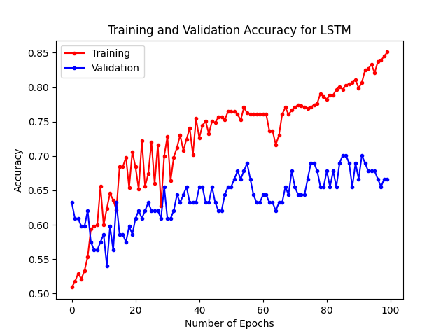
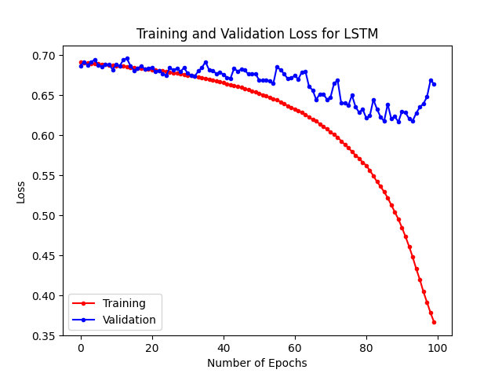

# Machine Translation Classification 

A classifier to identify if a sentence is human or machine translated. For Prof. Yoav Artzi and the LIL Lab @ Cornell Tech.

To run locally, `pip install -r requirements.txt`. Then run `python {model}.py`, where {model} is either lstm (LSTM), log_reg (Logistic Regression), or nn (RNN).

## Results (F1 Scores):
Logistic Regression: ~0.39
Baseline RNN: ~0.57
LSTM (Final Model): ~0.72

## Loss and Accuracy Curves for LSTM
### Accuracy

### Loss

